# Simulated-Annealing
 Implementing constrained optimization method simulated annealing

 

## About

This experiment uses the simulated annealing algorithm to solve the flow shop scheduling. Each workpiece needs to go through $m$ processes in sequence, and each process requires different machines to process and each machine can only process one workpiece at the same time. A workpiece cannot be processed on different machines at the same time and the processing time of each workpiece on each machine is given. According to the data provided in the document, arrange the processing sequence of m machines to process n workpieces, and ask to find the shortest processing time as much as possible. The simulated annealing algorithm is used to minimize the total work span, and a scheduling scheme is given, that is, the optimal processing sequence of $n$ workpieces on $m$ machines.

 

## Background

It is known that there are $n$ workpieces that need to be processed on $m$ machines, each workpiece is processed in the same order from the first machine to the last machine, each workpiece is released at time $0$, and each workpiece is processed on each machine. Only process the same workpiece once and cannot process the same workpiece on different machines at the same time. Each machine can only process one workpiece at a time. The data file provides 11 cases, and each case has the processing time of $m$ workpieces on $n$ machines, that is, each case has $n \times m$ numbers. The experiment requires the use of simulated annealing algorithm to solve the problem, the goal is to minimize the total completion time, and give the corresponding scheduling plan, the optimal processing sequence corresponding to the total completion time.

 

## Problem Description

Based on the above problem background, the following constraint equations are given, where $W_{i}$ is the processing order of the first $i$ workpieces, and $f(W_{i},j)$ represents the processing time of the $i$-th workpiece on the $j$-th machine in the data case. $T(W_{i},j)$ represents the total processing time required for the first $i$ workpieces on the first $j$ machines, and the ultimate goal of the experiment is to minimize the total processing time required for the first $n$ workpieces on the first $m$ machines, that is, the calculate the minimum value of $T(W_{n},j)$ .

The total processing time equation must meet the following constraints: 

1. The total processing time of the first workpiece in the first machine can be obtained directly from the data set, that is, the $f(W_{1},1)$ function can be called. 

2. The total processing time of the first $i$ workpiece on the first machine is the sum of the total processing time of the first $i-1$ workpiece on the first machine and the processing time of the $i$-th workpiece on the first machine, namely $T( W_{i-1},1) +f(W_{i},1)$ . 

3. The total processing time of the first workpiece on the first $j$ machines is the sum of the total processing time of the first workpiece on the first $j-1$ machines and the processing time of the first workpiece on the $j$-th machine, namely $T( W-{1},j-1) + f(W_{1},j)$ . 

4. The total processing time of the first $i$ workpieces on the first $j$ machines is $max ($the total processing time of the first $i-1$ workpieces on the first $j$ machines, the total processing time of the first $i$ workpieces on the first $j-1$ machines$)$ + the processing time of the $i$-th workpiece on the $j$-th machine, i.e. $max\{T(W_{i-1},j),T(W_{i},j-1)+f(W_{i},j)\}$ [1] .

    

The variables of the constraint equation are the machining order Wi of the first $i$ workpieces, where $i = 2,\cdots, n,\ j = 2,\cdots, m$ denotes n workpieces and m machines. The machining sequence Wi, as the parameter of the total machining time $T(W_{i},j)$ of the objective function, is the main factor affecting the total machining time. Different machining sequences will generate different total machining time. The purpose of the experiment is to find the minimum objective function value in the current search space, that is, the minimum total processing time. Therefore, it is necessary to continuously search for different processing sequences with a certain probability in the simulated annealing algorithm to increase the probability of finding the minimum processing time.

The following is the mathematical expression of the optimal scheduling problem of the assembly line:

$$
\begin{align*}
min\ \ \ \ \ \ \ \ \ &T(W_{n},m) \\
s.t.\ \ \ \ \ \ \ \ \ &T(W_{1},1)=f(W_{1},1), \\
\ \ \ \ \ \ \ \ \ &T(W_{i},1)=T(W_{i-1},1)+f(W_{i},1), \\
\ \ \ \ \ \ \ \ \ &T(W_{1},j)=T(W_{1},j-1)+f(W_{1},j), \\
\ \ \ \ \ \ \ \ \ &T(W_{i},j)=max\{T(W_{i-1},j),T(W_{i},j-1)\}+f(W_{i},j) \\
var.\ \ \ \ \ \ \ \ \ &W_{i},\ i = 2,\cdots;\ n,\ j = 2,\cdots, m
\end{align*}
$$
 

## Solution

The core of flow shop scheduling is to minimize the total processing time of all workpieces on all machines, that is, use the accumulation method of the total processing time of the first $i$ workpieces on the first $j$ machines to calculate the total processing time of the first n workpieces on the first m machines. . Among them, the variable of the constraint equation is the machining sequence $W_{i}$ of the first $i$ workpieces, and different total machining times are mainly found by looking for different machining sequences, and the Metropolis criterion in the simulated annealing algorithm is used to find a machining sequence that is not better than the current candidate machining sequence with a certain probability. to avoid the algorithm falling into the local optimal solution. In the case of finding a new shortest machining time, the shortest machining time and the optimal machining order are updated until the iteration terminates.

 

## Algorithm Explanation

In this experiment, the simulated annealing algorithm is used to solve the flow shop scheduling. By using this probability algorithm, the approximate optimal solution is found in a large search space within a certain time. This optimization method simulates slow cooling of metals, characterized by a gradual reduction in atomic motion, which reduces the density of lattice defects until the lowest energy state is reached.

The simulated annealing algorithm, independently proposed by Kirkpatrick et al. (1983) and Cerny (1985), is based on the way in which the crystal structure of a metal reaches a state close to the global minimum energy during annealing, or the method in which the objective function reaches a minimum during a statistical search. The objective function represents the current energy state, while moving to a new variable represents the change in the corresponding energy state. At each virtual annealing temperature, simulated annealing generates new potential solutions by changing the current state, generally neighbors of the current state, according to predetermined criteria. The reception conditions for new states are based on the Metropolis standard (Metropolis-Hastings Algorithm), and the above process of generating new states will be iterated until convergence [2].

The general optimization algorithm iteratively compares the output of the objective function of the current point and its adjacent points in the domain. If the output generated by the adjacent node is better than the current node, the output is saved as the basic solution for the next iteration. If the output of adjacent points is not better than the current node, the algorithm terminates the search process, so the general optimization algorithm is easy to fall into the local optimal solution. The simulated annealing algorithm presents an efficient solution to the problem of general optimization algorithms, which combines two iterative loops, the cooling process of simulated annealing and the Metropolis criterion. The basic idea of the Metropolis criterion is to randomly perform an additional search for the neighborhood solution with a certain probability, so as to avoid the algorithm from falling into local extreme points [3].

 

## Algorithm Flowchart

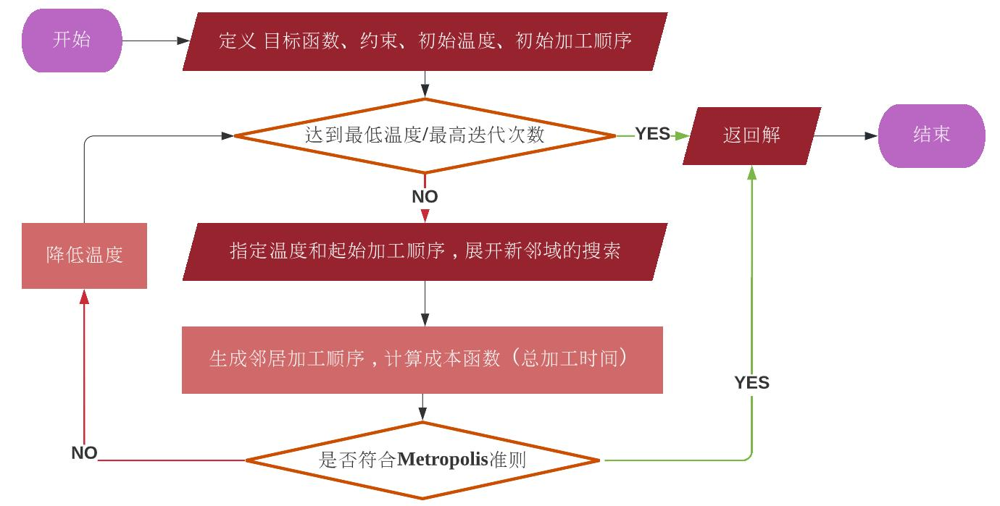

 

## Time complexity and space complexity analysis

The time complexity of the simulated annealing algorithm depends on two factors, the annealing temperature and its decrement rate, and the length of the Markov chain in it. The time required for the entire algorithm to run is mainly determined by the initial temperature $t_{0}$ and its decrement rate (decay coefficient $C$). The temperature decrement rate, $C$, is a floating-point number close to but less than 1 that controls the process of slowly decreasing temperature in the algorithm. 

There is a formula: $t_{k} = Ct_{k−1} , t_{k} = C^kt_{0} , k = \dfrac{ln(t_{k}/t_{0} )}{lnC}$ , where k is the number of iterations of the outer loop. The number of iterations of the inner loop needs to be customized. By the target The probability density function distribution of random variables on any interval of the function and the relaxation time of annealing can be deduced that $t_{k} = \alpha (T_{k−1} − T_{k}) ≤ ∆$, where $∆$ is the order of magnitude difference between the initial temperature and the final temperature, and $\alpha$ is a constant $\dfrac{1}{3}$. $T_{k}$ is the objective function (which is total machining time at time $k$) [4].

The algorithm terminates when $k > \dfrac{ln(∆ /t0 )}{lnC}$, $k_{finish} = \dfrac{ln( ∆ /t0 )}{lnC} + 1$, $k_{middle} =\dfrac{ln(t_{middle}/t0 )}{lnC}+ 1$, $t_{middle} < ∆$, it can be deduced that $k_{middle}< kfinish$ . If $t_{middle} = t_{0}/100$, $∆ = t_{0}/10000$, and $C = 0.99$, $k_{middle} = 459$, $k_{finish} = 917$, where $k_{middle}$ is the median of the total number of iterations of the outer loop, and $k_{finish}$ is the total number of iterations of the final outer loop [4]. 

Assuming that the number of iterations of the inner loop is $g$, the time complexity of the algorithm is $o(k_{finish} × g×( 2 × n× m) )$, where $n$ is the number of workpieces, $m$ is the number of machines, and $(n× m)$ represents the random number in the code. The time complexity of the function that generates the new solution is executed once each in the inner and outer loops, therefore we have $(2 × n × m)$ . The code defines a function to find the neighborhood solution. The function is to randomly exchange the order of the two workpieces in the current candidate processing sequence. Therefore, the time complexity of this function is $o(1)$, which is not written into the total time complexity of the algorithm. . The code sets $g=1000$, which means that each different temperature will iterate 1000 times as the temperature decreases.

 

## Environmental setup

Experimental environment :  Visual Studio Code 1.67.1 + Python 3.9.1

Experimental parameters   :                            
$$
For \ cases\ 0, 1, 2, 5\ \ \ \ \ use\ parameters\ \ \ \ (t_{0} = 100,C=0.9) \\
For \ cases\ 3, 4, 8\ \ \ \ \ \ \ \ \ use\ parameters\ \ \ \ (t_{0} = 500,C=0.99) \\
For \ cases\ 6, 7, 9, 10\ \ \ use\ parameters\ \ \  (t_{0} = 1000,C=0.99)
$$
 

## Result and Analysis

<h4 align="center">Table 1	Chart visualization of total machining time</h4>

| Instance | Graph (Job Time VS Sort Count)                               | Workpiece | Machine | $t_{0}$ | $C$  |
| -------- | ------------------------------------------------------------ | --------- | ------- | ------- | ---- |
| 0        | 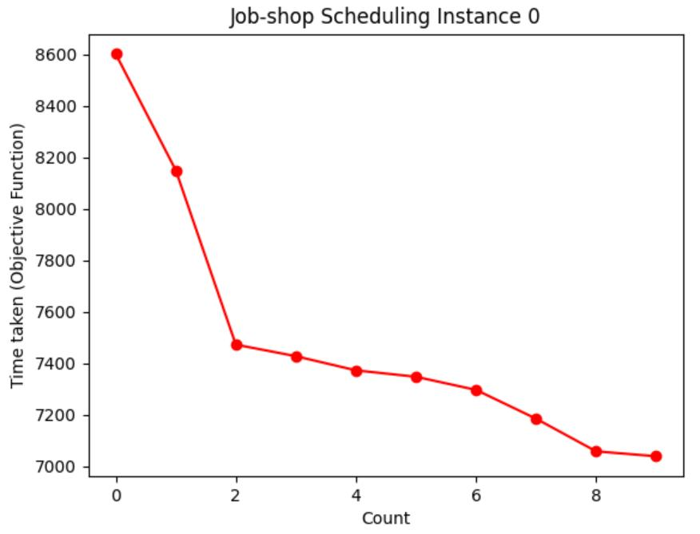 | 11        | 5       | 100     | 0.9  |
| 1        | 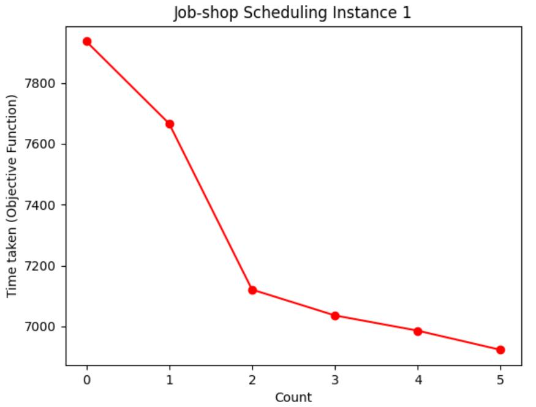 | 6         | 8       | 100     | 0.9  |
| 2        | 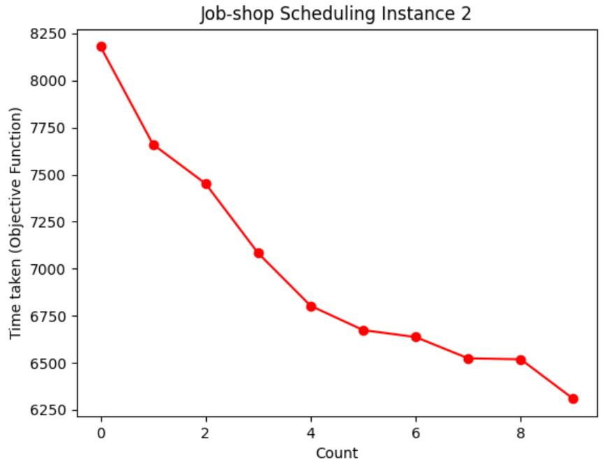 | 11        | 4       | 100     | 0.9  |
| 3        | 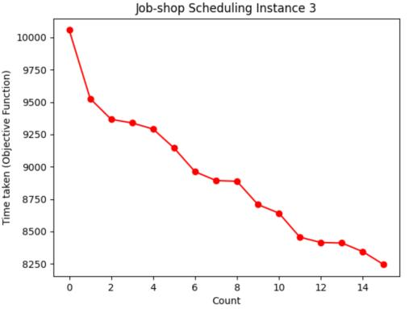 | 14        | 5       | 500     | 0.99 |
| 4        | 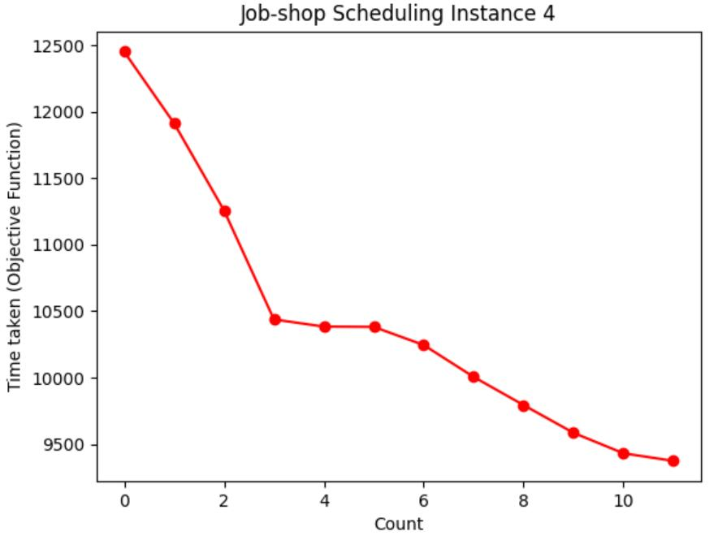 | 16        | 4       | 500     | 0.99 |
| 5        | 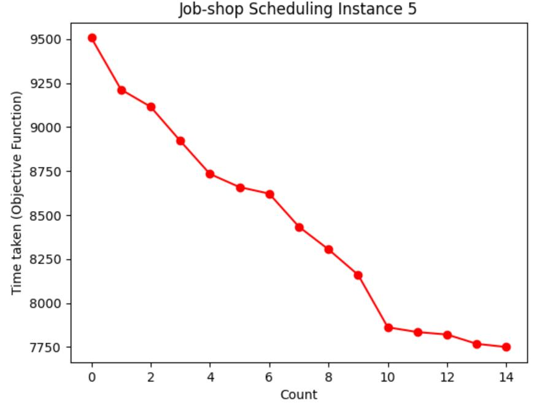 | 10        | 6       | 100     | 0.9  |
| 6        | 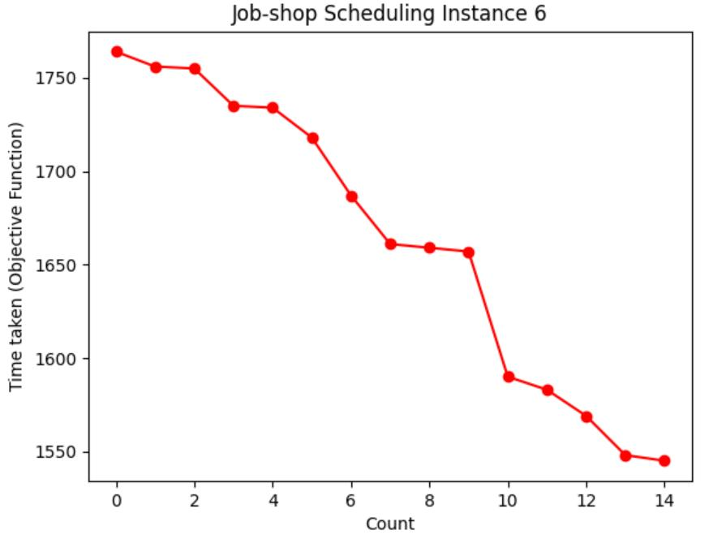 | 20        | 10      | 1000    | 0.99 |
| 7        | 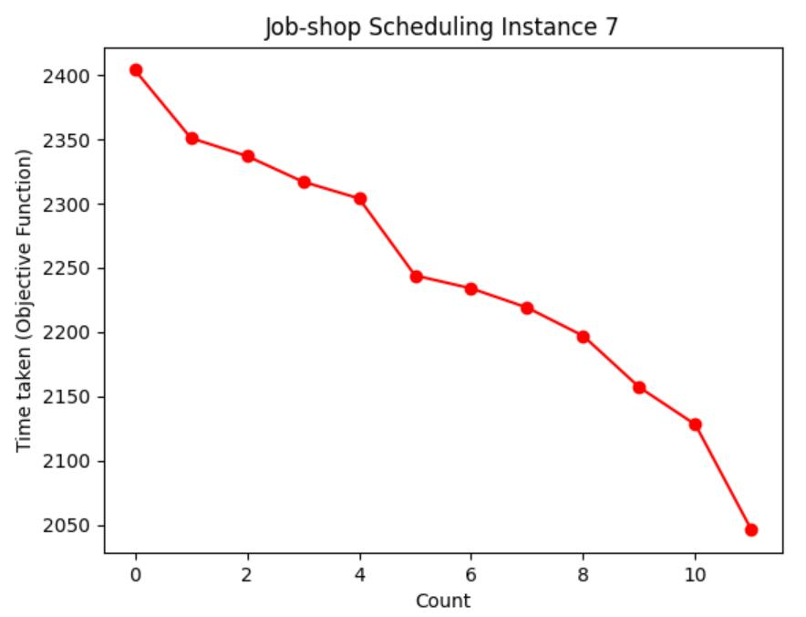 | 20        | 15      | 1000    | 0.99 |
| 8        | 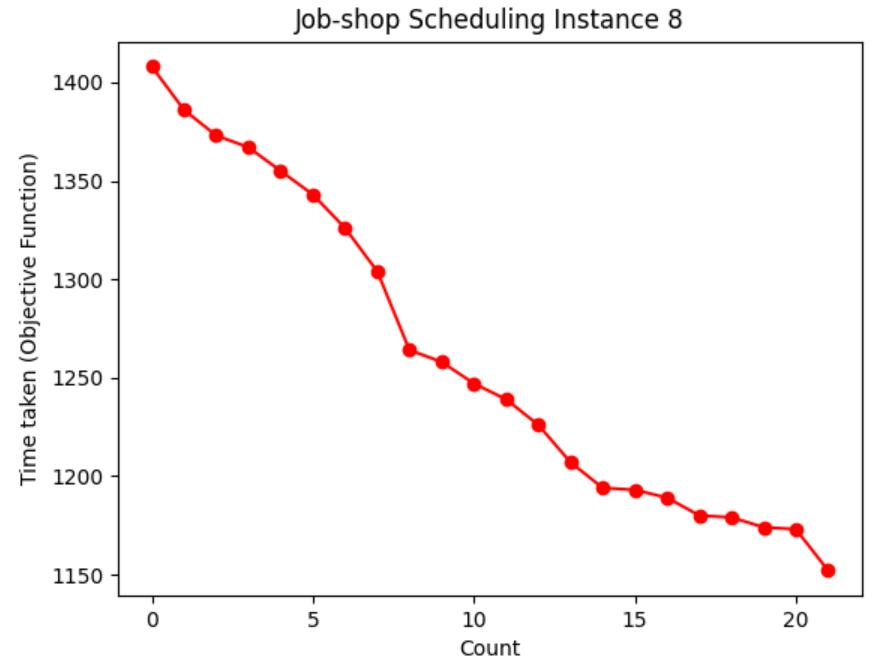 | 20        | 5       | 500     | 0.99 |
| 9        | 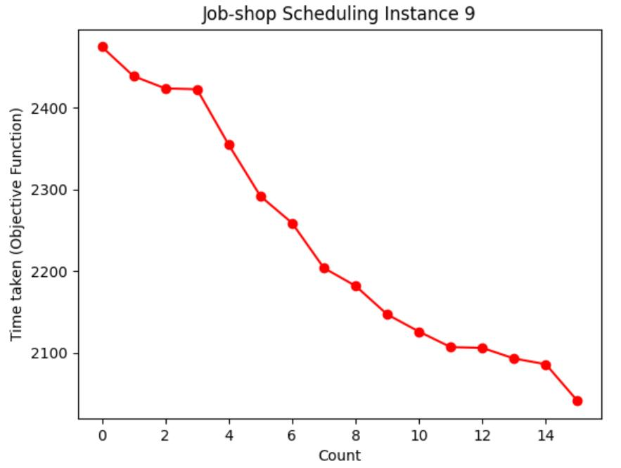 | 20        | 15      | 1000    | 0.99 |
| 10       | 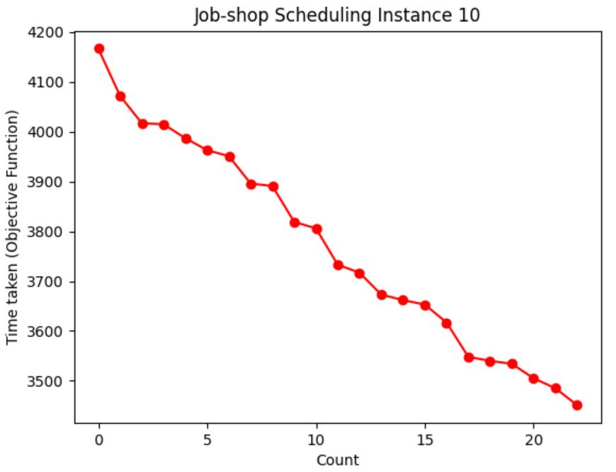 | 50        | 10      | 1000    | 0.99 |

 

<h4 align="center">Table 2	Optimal machining order and total machining time</h4>

| Instance | Optimal machining order                                      | Running time (ms) |
| -------- | ------------------------------------------------------------ | ----------------- |
| 0        | [7，6，0，4，10，3，5，9，1，2，8]                           | 7038              |
| 1        | [4，1，2，0，5，3]                                           | 6923              |
| 2        | [6，2，3，10，1，9，8，7，4，5，0]                           | 6309              |
| 3        | [0，9，6，8，7，3，13，5，2，10，12，1，4，11]               | 8244              |
| 4        | [5，8，10，0，7，3，14，15，9，1，13，6，4，12，11，2]       | 8373              |
| 5        | [3，0，1，4，2，6，8，7，5，9]                               | 7750              |
| 6        | [12，10，15，6，7，17，9，5，0，13，18，8，3，19，2，11，16，14，1，4] | 1545              |
| 7        | [0，9，15，7，8，17，2，18，3，5，11，14，13，12，1，16，19，4，6，10] | 2046              |
| 8        | [12，0，3，19，13，15，6，2，8，4，5，16，11，14，7，9，10，1，17，19] | 1152              |
| 9        | [1，15，12，7，10，16，3，18，17，14，2，6，4，0，5，9，8，11，13，19] | 2041              |
| 10       | [14，24，21，40，13，12，42，9，29，31，6，41，5，32，43，3，23，10， 15，39，2，27，49，38，25，26，1，17，22，4，46，19，36，7，47，28，0，8，44，45，18，34，16，35，48，30，33，20，37，11] | 3451              |

Table 1 shows the process of visualizing the objective function using a graph, recording the moment when the objective function value (total processing time) of each case is updated to the lowest value, and visualizing the decreasing route of the total processing time. It can be seen from Table 3 that the higher the initial temperature $t_{0}$ or the closer the temperature lapse rate $C$ is to 1, the higher the update frequency of the objective function, that is, the higher the probability that the algorithm continuously finds a new minimum total processing time. Therefore, for data cases with a large search space, a higher initial temperature $t_{0}$ and a temperature decrement rate $C$ closer to 1 should be used, so that the algorithm can find the global optimal solution in the space with a higher probability.

However, with a higher initial temperature $t_{0}$ and a temperature decrement rate $C$ that is closer to 1, the program will take longer to run. According to the time complexity analysis of the algorithm in 2.4, the time complexity of the algorithm is $o(k_{finish} × g×( 2 × n× m) )$, where $n$ is the number of workpieces, $m$ is the number of machines, and $k_{finish}$ is the total number of iterations of the final outer loop (where $k_{finish} = \dfrac{ln( ∆ /t0 )}{lnC} + 1$), and $g$ is the number of iterations of the inner loop. The code sets $g= 1000$, i.e. each different temperature loop for 1000 iterations as the temperature decreases.

 

<h4 align="center">Table 3	Simulated annealing algorithm solution process and result display</h4>

| Solution process and result display                          |
| ------------------------------------------------------------ |
| 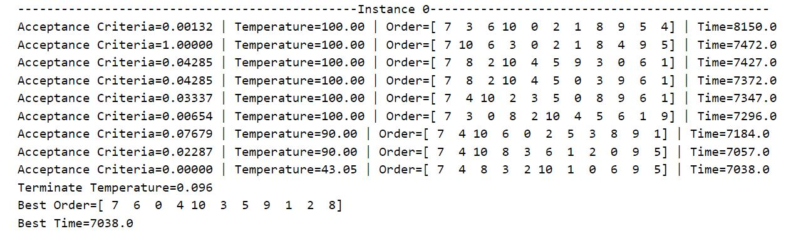 |
| 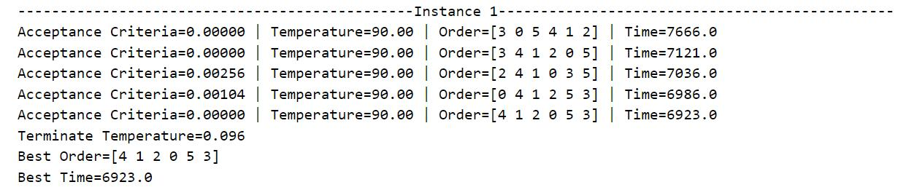 |
| 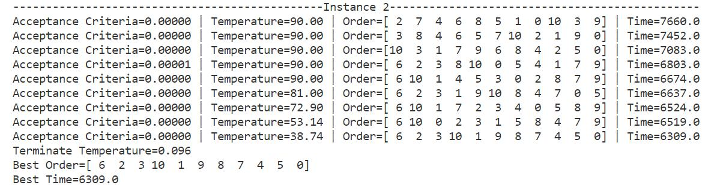 |
| 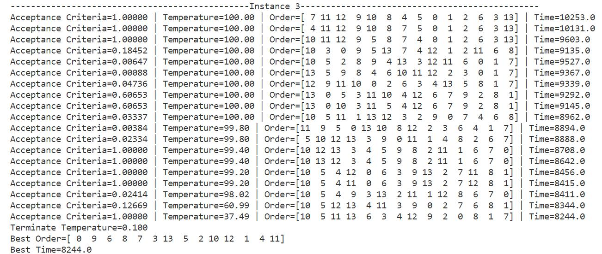 |
| 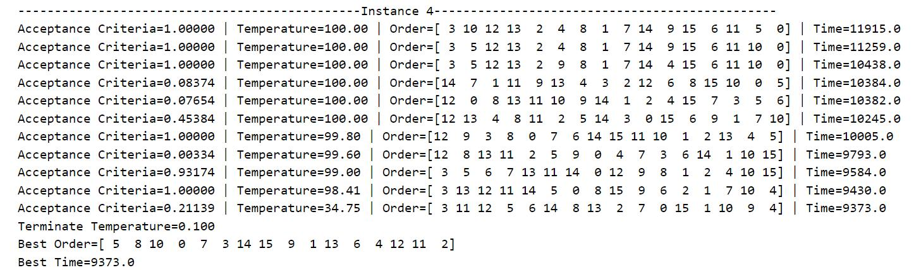 |
| 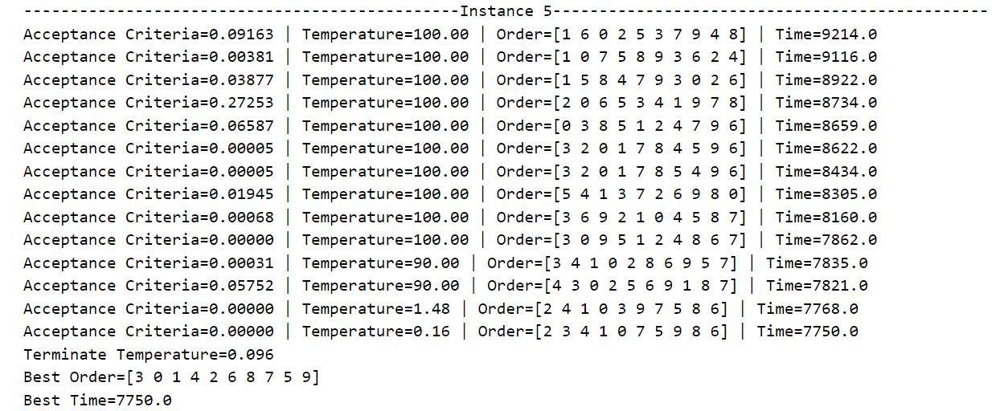 |
| 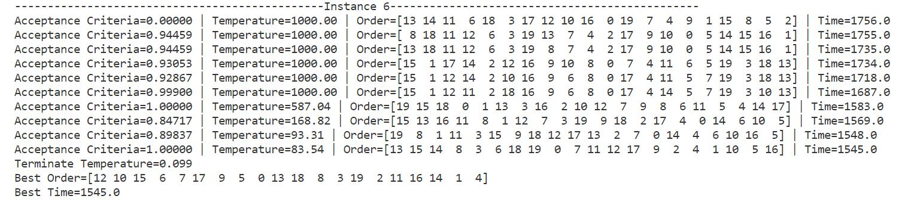 |
| 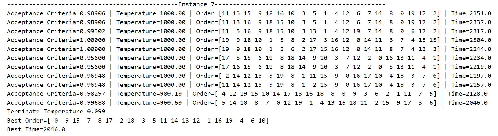 |
| 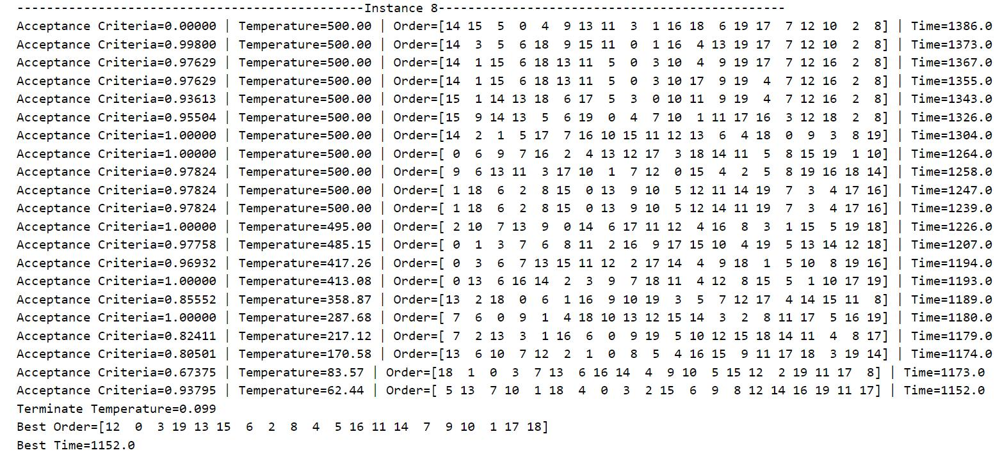 |
| 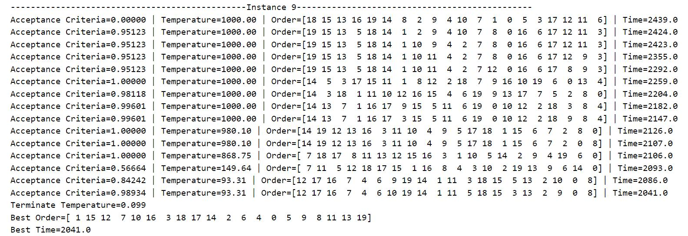 |
| 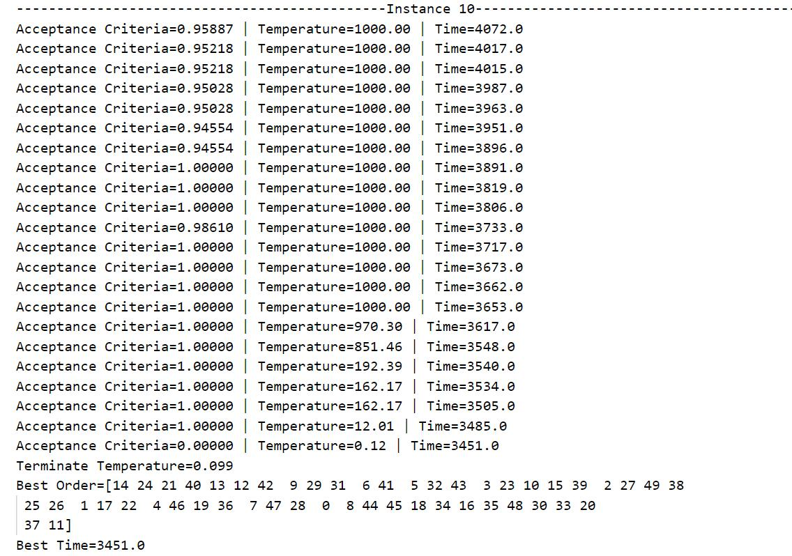 |

Table 3 shows the running process of the program and the final result. During operation, all cases will start from their predetermined initial temperature and slowly decrease according to the decrement rate until they fall below the minimum temperature defined in the code by 0.1. For the convenience of presentation, only the candidate processing sequence, total processing time and Metropolis criterion probability when the lowest processing time occurs each time is output, and the data of each iteration is not displayed. It can be seen from the data that as the temperature decreases, the total processing time gradually decreases, that is, the algorithm converges to the local optimal solution or the global optimal solution. 

The output "Acceptance Criteria" is the current Metropolis criterion probability (between 0 and 1), and "Terminate Temperature" is the lowest temperature that terminates the current iteration (less than or equal to 0.1). The optimal machining sequence and the lowest total machining time are output after the annealing process has run. Running the same case several times may obtain different optimal processing sequences and minimum total processing time, that is, the simulated annealing algorithm has a high probability of finding the global optimal solution in the search space, but it cannot guarantee that each execution of the program can be achieved. The global optimal solution may also fall into the local optimal solution with a certain probability. Therefore, in order to ensure that the current obtained solution approximates the global optimal solution, it is necessary to repeatedly run each case many times to continuously find the lowest total processing time.

 

<h4 align="center">Table 4	Comparison of parameters of each flow shop scheduling case</h4>

| Instance | Num of workpiece, $n$ | Num of machine, $m$ | Initial Temperature, $t_{0}$ | Decay Coefficient, $C$ | Running time (s) |
| -------- | --------------------- | ------------------- | ---------------------------- | ---------------------- | ---------------- |
| 0        | 11                    | 5                   | 100                          | 0.9                    | 7.25             |
|          |                       |                     | 500                          | 0.99                   | 105.53           |
|          |                       |                     | 1000                         | 0.99                   | 221.29           |
| 1        | 6                     | 8                   | 100                          | 0.9                    | 6.37             |
|          |                       |                     | 500                          | 0.99                   | 80.67            |
|          |                       |                     | 1000                         | 0.99                   | 191.34           |
| 2        | 11                    | 4                   | 100                          | 0.9                    | 6.09             |
|          |                       |                     | 500                          | 0.99                   | 140.88           |
|          |                       |                     | 1000                         | 0.99                   | 173.82           |
| 3        | 14                    | 5                   | 100                          | 0.9                    | 16.31            |
|          |                       |                     | 500                          | 0.99                   | 113.28           |
|          |                       |                     | 1000                         | 0.99                   | 192.84           |
| 4        | 16                    | 4                   | 100                          | 0.9                    | 10.34            |
|          |                       |                     | 500                          | 0.99                   | 109.78           |
|          |                       |                     | 1000                         | 0.99                   | 238.90           |
| 5        | 10                    | 6                   | 100                          | 0.9                    | 8.09             |
|          |                       |                     | 500                          | 0.99                   | 105.15           |
|          |                       |                     | 1000                         | 0.99                   | 165.66           |
| 6        | 20                    | 10                  | 100                          | 0.9                    | 30.81            |
|          |                       |                     | 500                          | 0.99                   | 333.28           |
|          |                       |                     | 1000                         | 0.99                   | 342.16           |
| 7        | 20                    | 15                  | 100                          | 0.9                    | 45.09            |
|          |                       |                     | 500                          | 0.99                   | 508.24           |
|          |                       |                     | 1000                         | 0.99                   | 522.76           |
| 8        | 20                    | 5                   | 100                          | 0.9                    | 22.25            |
|          |                       |                     | 500                          | 0.99                   | 167.72           |
|          |                       |                     | 1000                         | 0.99                   | 251.45           |
| 9        | 20                    | 15                  | 100                          | 0.9                    | 43.36            |
|          |                       |                     | 500                          | 0.99                   | 484.15           |
|          |                       |                     | 1000                         | 0.99                   | 504.17           |
| 10       | 50                    | 10                  | 100                          | 0.9                    | 129.44           |
|          |                       |                     | 500                          | 0.99                   | 851.30           |
|          |                       |                     | 1000                         | 0.99                   | 894.92           |

We have the total number of iterations of the final outer loop $k_{finish} = \dfrac{ln( ∆ /t0 )}{lnC} + 1$, and the time complexity of the algorithm which is  $o(k_{finish} × g×( 2 × n× m) )$ . The number of iterations of the inner loop $g$ is set to 1000.

- According to Case 0 in Table 4, if the initial temperature $t_{0}=100$ and the temperature decrement rate $C = 0.9$, then there is $k_{finish} = \dfrac{ln( 0.096/100)}{ln0.9} + 1=67,n=11,m=5$, so the time complexity is $67×1000×(2×11×5)=7.37×10^6$, and the running time is 7.25 seconds.
- According to Case 1 in Table 4, if the initial temperature $t_{0}=100$ and the temperature decrement rate $C = 0.9$, then there is $k_{finish} = \dfrac{ln( 0.096/100)}{ln0.9} + 1=67,n=6,m=8$, so the time complexity is $67×1000×(2×6×8)=6.43×10^6$, and the running time is 6.37 seconds.
- According to Case 8 in Table 4, if the initial temperature $t_{0}=500$ and the temperature decrement rate $C = 0.99$ then there is  $k_{finish} = \dfrac{ln( 0.099/500)}{ln0.99} + 1=849,n=20,m=5$, so the time complexity is $849×1000×(2×20×5)=169.80×10^6$, and the running time is 167.72 seconds.
- According to Case 1 in Table 4, if the initial temperature $t_{0}=1000$ and the temperature decrement rate $C = 0.99$, then there is $k_{finish} = \dfrac{ln( 0.099/1000)}{ln0.99} + 1=918,n=50,m=10$, so the time complexity is $918×1000×(2×50×10)=918.00×10^6$, and the running time is 894.92 seconds.

It can be seen from the calculation results of the above time complexity that, corresponding to different cases and different parameters, the time complexity calculation results are still proportional to the running time in Table 4. Therefore, it can be intuitively seen that the main factors affecting the running time of the program are the number of workpieces, the number of machines, the number of iterations of the outer loop and the number of iterations of the inner loop, of which the initial temperature $t_{0}$ and the temperature decrement rate $C$ directly affect the number of iterations of the outer loop. The higher the initial temperature and the rate of temperature decrement, the higher the number of outer loop iterations. The number of workpieces and the number of machines are set by the data in the document and cannot be changed by themselves. Therefore, the initial temperature $t_{0}$, the temperature decrement rate $C$, and the number of iterations of the inner loop $g$, can only be adjusted by code to optimize the algorithm and obtain the optimal solution within a limited time.

 

## Personal Summary

From this experiment, I learned how to use the simulated annealing algorithm to optimally schedule workpieces and machines in a flow shop. If the number of workpieces and machines is larger, that is, the search space is larger, a higher initial temperature and a temperature decrement rate closer to 1 should be set, so that the current candidate processing sequence has enough time and a higher probability to jump out of the trap itself. In the range of local minima, it slowly converges in the direction of the global optimal solution.

Since the simulated annealing algorithm is meta-heuristic, different parameters need to be tuned. Although setting a higher temperature for cases with small search space can ensure better model performance, the convergence speed may be too slow, and perhaps setting a lower temperature can also obtain the corresponding global optimal solution; while for cases with large search space If the temperature is set lower in the case, the convergence speed is too fast, and the global optimal solution may not be obtained. Therefore, when initializing the parameters in the code, I specially set the appropriate initial temperature and temperature decrement rate for the case according to the size of the number of workpieces and the number of machines, which is convenient for the execution of the program and does not need to be executed for each different case to modify.

The Metropolis criterion in the simulated annealing algorithm also improves the traditional optimization algorithm. It adopts a multiple search strategy to allow the current candidate solution to accept the neighborhood solution that is not better than it with a certain probability, so as to avoid the algorithm from falling into the deadlock of the local optimal solution. On the other hand, the heating function can be set in the algorithm to lower the temperature under certain conditions and adjust the search strategy. Simulated annealing algorithm can also be combined with other algorithms such as genetic algorithm, chaotic search, neural network, gradient method, etc. for further optimization.

 

### *Reference:*

[1]   Milos S. Mathematical Models of Flow Shop and Job Shop Scheduling Problems[J]. *International Journal of Physical and Mathematical Sciences*, 2007, 1(7): 308.

[2]   Mohammed G, Vassili V, Amir H. A Review on Traditional and Modern Structural Optimization: Problems and Techniques[M]. *Amsterdam: Elsevier,* 2013, 5-10.

[3]   Ozan E. Optimization in Renewable Energy Systems[M]. *Oxford: Butterworth-Heinemann*, 2017, 27-74.

[4]   李元香, 项正龙, 张伟艳. 模拟退火算法的弛豫模型与时间复杂性分析[J]. *计算机学报*, 2020, 43(5): 802-803.
